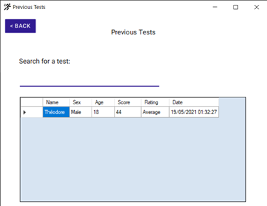

## I – Design &amp; functionalities

 The application is divided into two main features, the first one is the possibility to consult previous tests and the other one is to achieve new tests.

On the previous test window, you can search for a previous test participant and get information on his test such as the date, his score, his age…
You have also a back button which is everywhere in all the windows in order to easily navigate between windows.

 
 
 
 
 
 

The second feature starts on this window. It allows you to add participant to the current test session. You can use the button import a list to import it from an excel or csv file with three columns (Name, Age and Sex). Once the participant list done you can select the step size that will be used during the session and start the test session.

 
 
 
 
 
 
 

This is the main window of the program. Each tab is for a participant of the test session so you can perform every test at the same time. On the header we can see basic information such as heart rate, age, test, etc… On the chart at the beginning, we can only see the two red lines representing 50% and 85% of the heart rate.

You can then enter value in the text field in the right column.

 
 
 

Once the five values entered, the aerobic capacity and the fitness are computed, and the chart shows us the five point and the computing lines so we can be sure the computation is well done. We can then click on save and close to save the test to the database and close the tab. When there is no remaining participant, the program proposes us to get back to the main menu.
 
 
 
 

## II – Testing Strategy

Multiple testing strategies were set up in order to prevent bugs. The first thing was to test every new feature several times with all the possibilities. Next, we checked with calculator on the internet if our test result were ok according to the input values. We also checked verified if it was the same the on Excel. Another way of testing was to verify with our eyes if the computation lines were placed correctly on the chart. I also checked results using the console to verify if my computations were right.

## III – Comparison with the original design

First of all, I would say than it was a lot harder than expected… Indeed, when I design the app diagram for instance, I would never have imagined that it will be so complex. We can see on the left diagram (the initial one) than there where only four classes and there were really basic. The two classes that are the most near the reality are the _DatabaseHandler_ and the _TestModel_.

 
 
 
 
 
 

Here is the model generated by visual studio on our project. We can first see that a parent class for the forms was not expected but I figured out that it was quite useful to have one, especially for the possibility to switch form without stacking or hiding them. Another thing that I forgot was the _Sex__enum_, I did not consider that the gender could impact the results, so I did not include it in my first diagram. Utils class such as _Utils_ and _Bounds_ were not included because they are link with mathematical or data operation so I realize I would need that at the moment. And there is also the _ParticipantInfos_ model class that I did not included.

 
 

## IV – Nice features, libraries, and good practices

Here is some nice feature that I made:

- The ApplicationForm use the OOP model to handle common behavior such as forms that can switch and material design customization. Every form extends the ApplicationForm except from the tab and the modal form.
- The TestSessionForm is only composed of a tab view, every tab is another form. It allows to separate logic for each current test in the test session and to not mix everything. It also fully takes party of the OOP paradigm in C#.
- The TabTestForm include a chart with data displayed in real time so that the user can understand what he is doing and what the program is doing.
- If the user clicks on the back button during a Test session, the list of the non-finished will be kept.
- Everything done by the user that should not be expected (for instance an empty field or a number field filled with characters) will be catch and a little alert will be shown to the user so that the app does not crash.

Here are the libraries used:

- The MathNet library to compute the best line from an array of point (it uses linear regression)
- The MaterialDesign library for windows form in order to have fancy buttons.

Here are the good practices that I respected:

- Every variable name, methods names, attributes names, class names, getter &amp; setters names are in the good case (PascalCase for class, getter &amp; setter, methods and camelCase for variables and attributes).
- My OOP structure respects the encapsulations rules so that the code is scalable.
- The code is well documented with comments so that everyone can easily understand and contribute to the project (it is important to work in team when developing software)
- The code is hosted on Github and people can contribute. ([Totodore/StepTestApplication: Little application assignment made for the Glyndwr University. It aims at performing easy health tests. (github.com)](https://github.com/Totodore/StepTestApplication))

## V – Future ways of enhancement

- A better UI, more user friendly, it is not the best thing to switch windows. The best things would be to constantly update inner content (inside the window).
- An online database, it would allow users to have multiple devices.
- The possibility to export and edit the previous tests.
- There is a little bug due to the material design library that I use on the TabForm (There is a second taskbar in purple beneath the Windows one).
